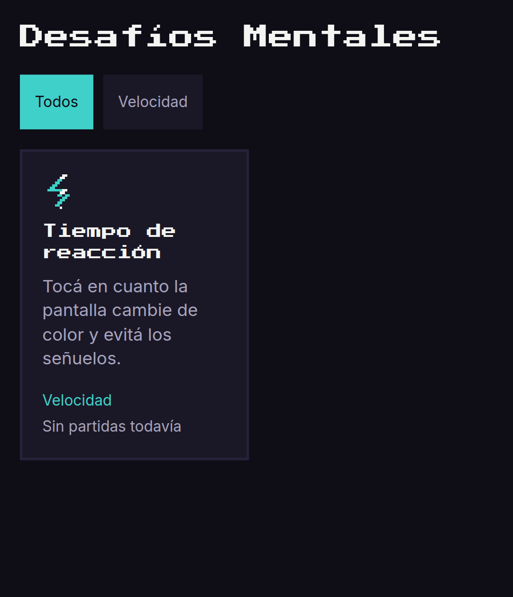

# Desafíos Mentales

Colección de juegos mentales para celular —matemática, lógica, memoria, velocidad y razonamiento espacial— con estética **pixel art minimalista**. Sin publicidad, sin cuentas, sin promesas de mejora cognitiva: solo entretenimiento desafiante.

Es también un caso documentado de desarrollo con [Claude Code](https://claude.com/claude-code) ("vibe coding"): cada juego se construye como un módulo independiente que se enchufa a una plataforma común, en general en una sola sesión de agente. El documento completo de producto vive en [`docs/PRD.md`](docs/PRD.md).



## Jugar

👉 https://ftranchet.github.io/desafios/ (se publica automáticamente en cada push a `main`)

Es una PWA: se puede instalar en la pantalla de inicio del celular y funciona sin conexión después de la primera carga.

## Correr localmente

Requiere Node.js 20+.

```bash
npm install
npm run dev        # servidor de desarrollo
npm run test       # tests de lógica (Vitest)
npm run lint        # ESLint
npm run typecheck   # TypeScript en modo estricto
npm run build        # build de producción a dist/
npm run preview      # sirve el build de producción localmente
```

## Cómo agregar un juego

Cada juego es una carpeta independiente en `src/games/` que implementa el contrato de `src/core/contract.ts`. El shell (catálogo, navegación, estadísticas) nunca conoce el interior de un juego — solo interactúa con él a través de ese contrato.

1. Creá `src/games/<game-id>/`.
2. Implementá `logic.ts` (funciones puras, sin React ni DOM, con toda la aleatoriedad pasando por `src/core/random.ts`), `ui.tsx` (el componente, implementa `GameProps`) e `index.ts` (exporta el `GameModule`).
3. Dibujá el sprite-ícono 16×16 del juego como SVG en grilla de píxeles (mirá `src/games/reaction-time/icon.svg` como referencia), usando solo los colores de `tailwind.config.ts`.
4. Escribí `logic.test.ts` con semilla fija.
5. Registrá el módulo en `src/core/registry.ts` — una línea.
6. Corré `npm run lint && npm run typecheck && npm run test && npm run build` antes de dar la tarea por terminada.

Los detalles completos —incluida la checklist de "terminado"— están en `docs/PRD.md` (secciones 5.5 y 12.3) y en `CLAUDE.md`.

## Arquitectura

- **Shell** (`src/shell/`): catálogo, pantalla de juego, estadísticas y configuración. Único lugar con estado global (`useSettingsStore`, Zustand) y acceso a `localStorage`.
- **Core** (`src/core/`): el contrato de módulo, el registro de juegos, persistencia, aleatoriedad con semilla, temporizadores y sonido.
- **Games** (`src/games/`): un módulo independiente por juego, cada uno con su propia lógica pura y tests.
- **Tokens de diseño** (`tailwind.config.ts`): paleta (≤ 12 colores), tipografía y escalas — el contrato visual que comparten todos los juegos.

Las decisiones de arquitectura están documentadas como ADRs en [`docs/decisions/`](docs/decisions/).

## Licencia

[GNU General Public License v3.0](LICENSE). Cualquier versión modificada que se distribuya debe publicar su código fuente bajo la misma licencia.
